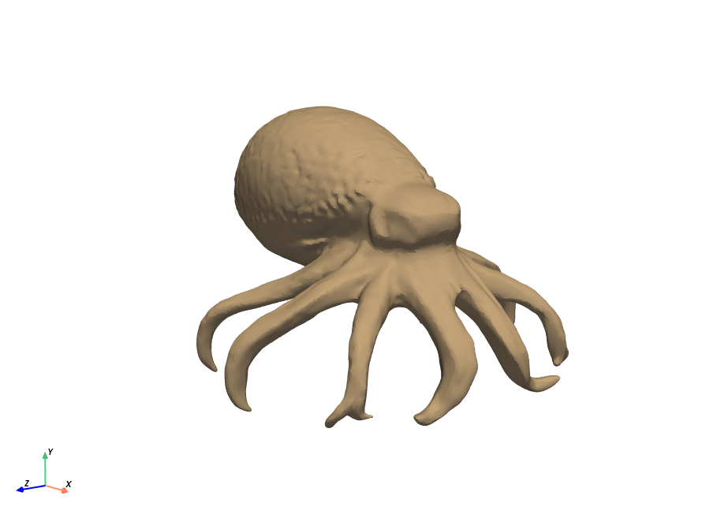
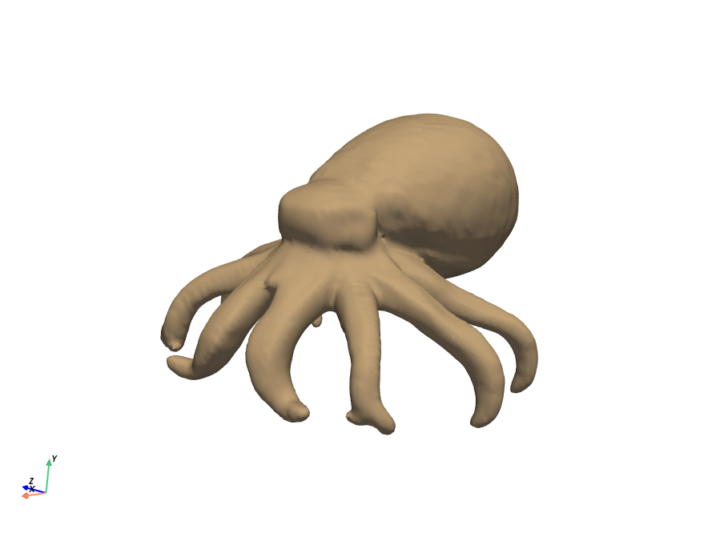
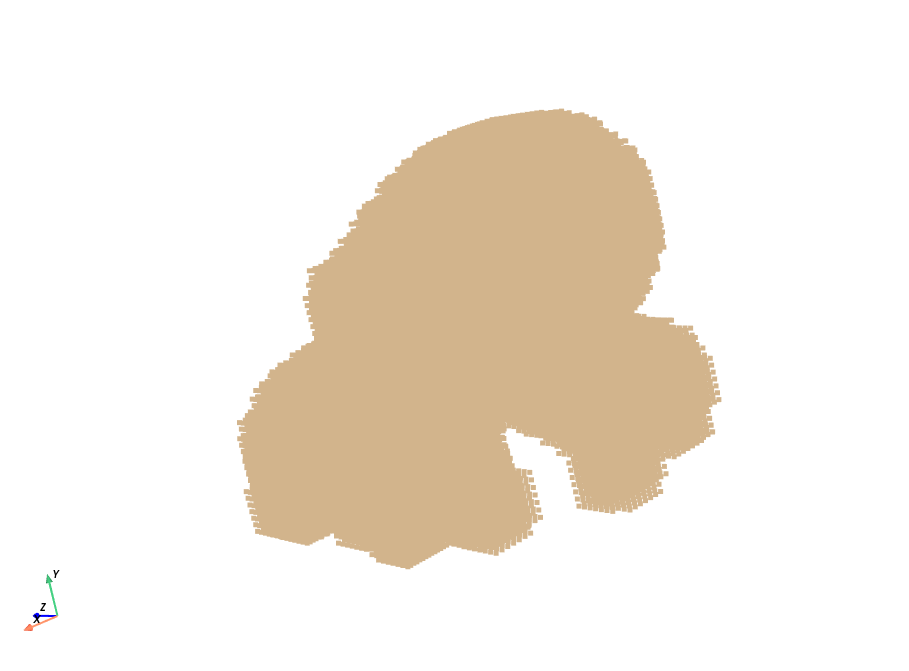
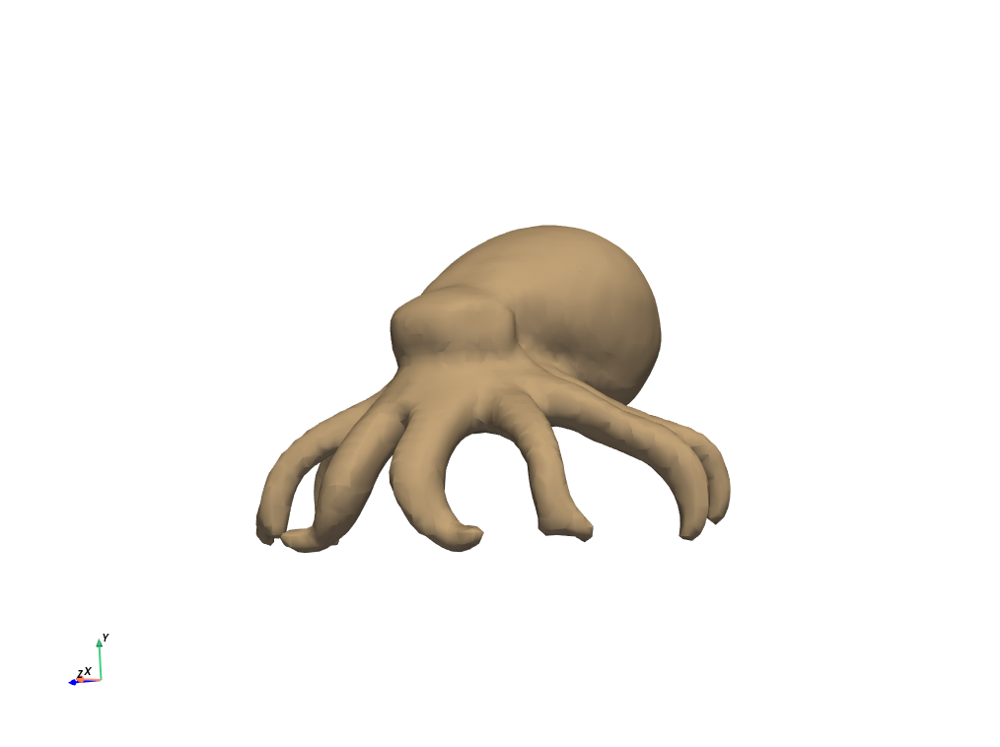
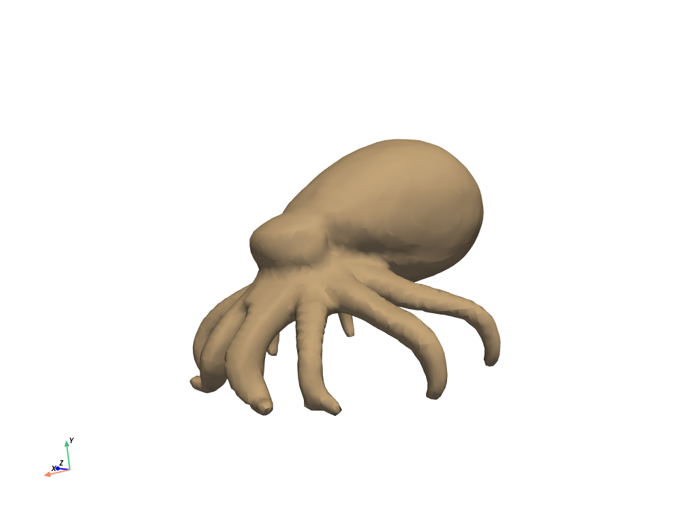

# Unofficial implementation of MosaicSDF representation (no training yet)

This is an unofficial implementation of the MosaicSDF representation from the paper ["Mosaic-SDF for 3D Generative Models
"](https://lioryariv.github.io/msdf/)

This code  contains functions for `mesh -> msdf` and `msdf -> mesh` conversion. 
MSDF representation is a set of grids cubic grids parametrized by grid center and scale. Each grid cell contains a signed distance value. For more detailed explanation please read paper.

## MSDF representation cons

MSDF is a constant size representation for 3D shapes, so it can be easily used for training ML models (especially generative ones).

Representation shape is `N x (K**3 + 3 + 1)` where `N` - number of grids (1024 in paper and this repo),  `K` - grid size (7 in paper and this repo), `3` - grid center, `1` - grid scale. So with default params mesh can be represented as `1024x347` tensor.

## Installation

Run `poetry install` to install all dependencies.

## Example of work

Example of work on test mesh from `assets/octopus/model.obj`:

```bash
python3  scripts/optimize_msdf.py
```

Original mesh 
Mesh after applying watertight preprocessing 
Sampled grid points 
Mesh reconstructed from msdf representation using marching cubes and resolution=32 
Mesh after optimization 

## Implementation notes

### Speed

However I tried to make it fast, mesh reconstruction from msdf representation is still slow such as we need to calculate aggregation of all grid cells for each point in the grids. Maybe it can be optimized by calculation aggregation of obly top-K nearest grids.

### Optimization

The big chance that something is wrong with my optimization, it doesn't converge and optimized mesh looks in the same way as non-optimized.

